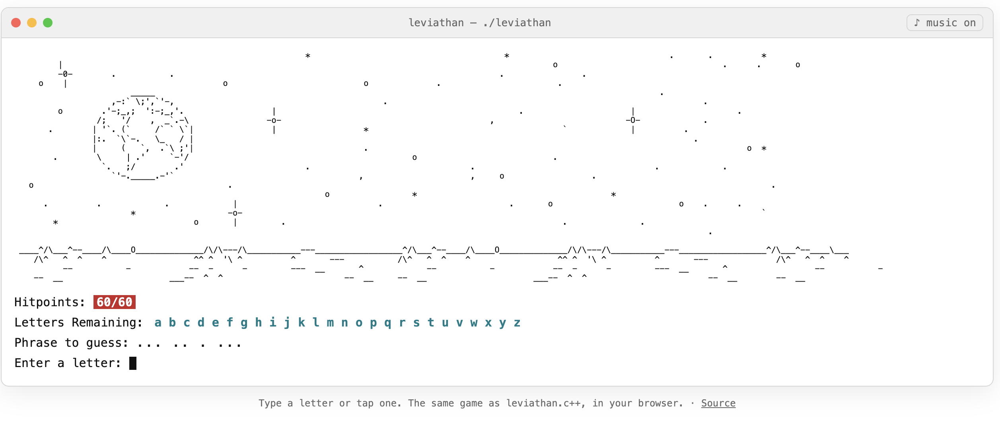
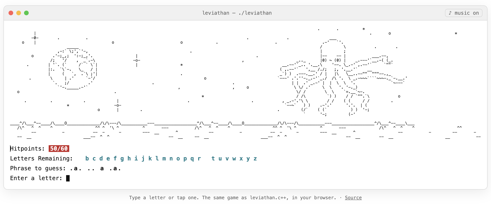
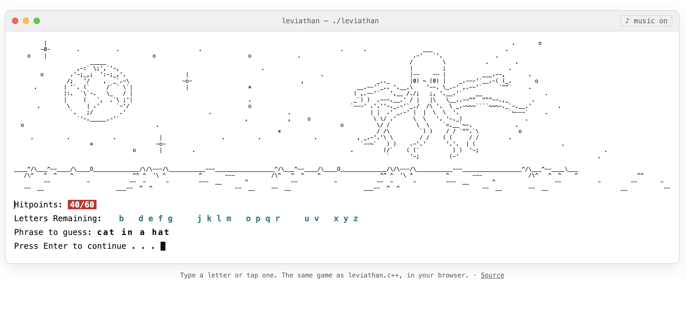
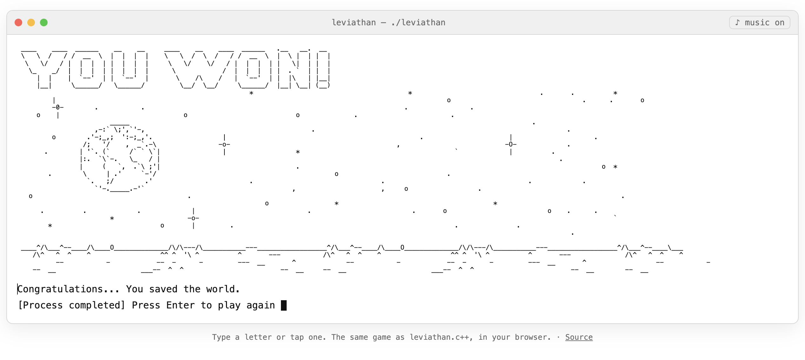

# The Leviathan

A phrase-guessing game written in C++ for the terminal and drawn entirely in ASCII art.
A planet-eating leviathan is drifting toward Earth. Guess the secret phrase one letter at a
time before it arrives. Every wrong letter costs 10 hitpoints and brings the monster closer.

**Play it in your browser:** <https://the-leviathan.vercel.app/>

The web version runs the same game with the same ASCII screens, taken straight from the C++
source. There's nothing to install.

| | |
|---|---|
|  |  |
|  |  |

---

## How to play

1. The title screen appears. Press **Enter** to begin.
2. A random secret phrase is chosen and shown as dots, for example `.. ....... .. ....`.
   Spaces between words are shown.
3. Type a letter:
   - **Right:** every place that letter appears in the phrase is revealed.
   - **Wrong:** you lose **10 hitpoints** and the leviathan moves one step closer to the planet.
4. **Win:** reveal the whole phrase before your hitpoints run out, and you save the world.
5. **Lose:** after six wrong letters (60 → 0 hitpoints), the leviathan reaches the planet.

The status area under the art shows:

| Line | Meaning |
|------|---------|
| `Hitpoints: 60/60` | Health left. Each wrong guess removes 10. |
| `Letters Remaining: a b c …` | Letters you haven't tried yet. Used letters disappear. |
| `Phrase to guess: .. .....` | The secret phrase, filled in as you guess. |

### The phrases

The game picks one of these at random:

- to thyself be true
- fit as a fiddle
- good guys always win
- just drink more coffee
- cat in a hat

---

## Screens

The game has nine full-screen ASCII scenes. They're drawn up to 199 characters wide, so widen
your terminal or make the font smaller to see them without wrapping.

| Screen | When it shows |
|--------|---------------|
| Title banner (`THE LEVIATHAN`) | At start-up |
| Stage 0 | Full health: Earth, stars and rocky ground, no monster yet |
| Stages 1–5 | After each wrong guess the leviathan moves further left, toward Earth |
| `YOU WON!` | You solved the phrase and the planet is safe |
| `YOU LOST!` | The leviathan has wrapped itself around the planet |

---

## Running the console version

You need a C++11 compiler (`g++` or `clang++`). Any macOS, Linux or Windows terminal that
understands ANSI color codes will do.

```bash
# build
g++ -std=c++11 -o output/leviathan leviathan.c++

# play
./output/leviathan
```

On Windows (MinGW):

```bash
g++ -std=c++11 -o leviathan.exe leviathan.c++
leviathan.exe
```

Tips:

- **Make the window wide.** The art is up to 199 columns, and a narrow terminal wraps it.
- **Colors:** the hitpoints are white on red and the remaining letters are cyan. Everything
  else uses your terminal's own colors. For black art on a white background, switch your
  terminal to a light profile (macOS Terminal: *Settings → Profiles → Basic → Default*).
- Press **Enter** after each letter. Press **Ctrl+C** to quit at any time.

---

## Running the web version locally

The web version is a static page, so there's nothing to build. Open `index.html` in a browser, or
serve the folder:

```bash
python3 -m http.server 8000   # then visit http://localhost:8000
```

Controls: type a letter on your keyboard, or tap one in *Letters Remaining* (handy on phones).
Press **Enter**, or tap the blinking prompt, to continue. The **♪ music** button in the title bar
toggles the background track, *Ride of the Golden Bloom* by Dian Shuai
(`ride-of-the-golden-bloom.mp3`).

The page shows the art in black on white. The art shrinks to fit the window, so the whole
scene is visible on a phone too.

### Keeping the web art in sync with the C++ code

The web page doesn't contain its own copy of the art. It loads `art.js`, which is **generated
from `leviathan.c++`**. If you change any ASCII art or the title in the C++ file, regenerate
it with Node.js:

```bash
node scripts/extract-art.mjs
```

The script reads every `cout<<"...\n";` line inside `IntroScreen()`, `WinningScreen()`,
`LoosingScreen()` and the six `if(BadGuesses==N)` blocks, turns the C++ escapes back into
plain text (`\\` → `\`, `\"` → `"`), and writes the result to `art.js`.

---

## Project layout

```
leviathan/
├── leviathan.c++           # the game: all ASCII art and game logic
├── index.html              # web version (terminal-style page)
├── art.js                  # ASCII art for the web page, generated from leviathan.c++
├── scripts/
│   └── extract-art.mjs     # regenerates art.js
├── ride-of-the-golden-bloom.mp3  # background music for the web version
├── screenshots/            # preview images used in this README
└── output/                 # compiled console binary (ignored by git)
```

---

## How the code works

`leviathan.c++` follows the numbered steps in its comments:

1. **Intro:** `IntroScreen()` prints the banner and waits for Enter.
2. **Pick a phrase:** `srand(time(NULL))`, then a random pick from the `Phrases` array.
3. **Hide it:** `GuessPhrase` is a copy with every non-space character replaced by `.`.
4. **Game loop:** runs while `BadGuesses < 6` and the phrase isn't solved:
   - clear the screen (`\033[2J\033[1;1H`) and draw the stage for the current `BadGuesses`
   - print hitpoints, letters remaining and the phrase so far
   - read a letter, remove it from `LettersRemaining`, then reveal every match with
     `string::find` or add a bad guess
5. **Ending:** clear the screen and show `WinningScreen()` or `LoosingScreen()`.

`Pause()` replaces the old `system("pause")`, which only exists on Windows
(on macOS and Linux it printed `sh: pause: command not found` and never waited).

---

## History

The game began as *The Kraken*, was renamed *MystiQ*, then briefly turned into a plain HTML
word-guessing page that fetched words from an online API. That page has now been replaced by
the ASCII version above, and the monster has been renamed **The Leviathan**.
